This is a documentation of the process of the creation of the output presented during the internship

The first thing I did was to create a normal index.php on my physical machine which runs on Windows

# Installations

In order for the required task to be delivered, some files and software need to be installed. This section will discuss the process of installation of each required software.

## Git CLI (Windows)

1. Go to the git website download section: https://git-scm.com/downloads
2. Download git setup for windows

   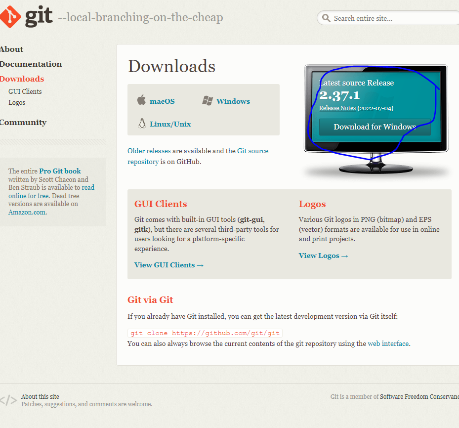

3. Run the setup. Then click next.

   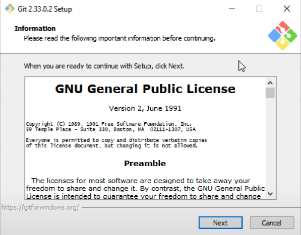

4. Enter the preferred location of Git.

   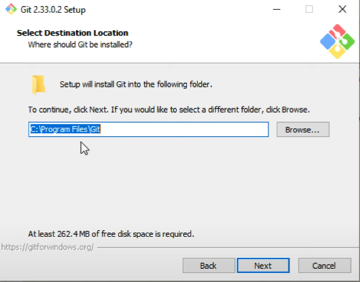

5. Then leave everything on default.

## VirtualBox

VirtualBox allows you to install many Operating Systems virtually on the host operating system

1. Going to the official virtual box website: https://www.virtualbox.org/wiki/Downloads
2. Download VirtualBox setup according to the unit’s host operating system (Windows in this case).
3. Open the executable file and indicate the preferred location of installation
4. Leave everything in the default settings and install

## Ubuntu 20.04 Server

1. Create a virtual machine using the Virtual Box

   1. Click the New button

      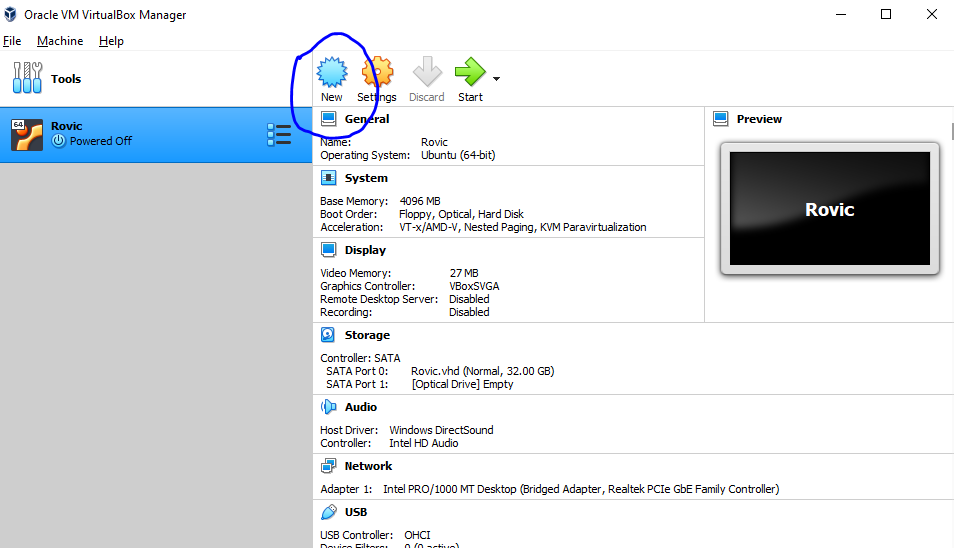

   2. Click the expert mode to have complete control of the virtual machine’s settings and resources

      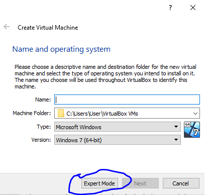

   3. There are things that need to be provided, namely: (1) the name of the virtual machine; (2) The location where to put the machine. (3) The type of operating system, which is Linux; (4) The version, which is Ubuntu 64-bit; (5) the memory size to allocate; and (6) the hard disk configuration, which is set to create a virtual hard disk.

      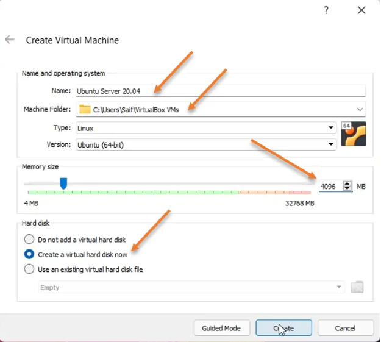

2. Create a virtual hard disk. Fill in the required information: (1) Desired Location of the virtual hard disk; (2) Specifying the size of the hard disk; (3) Hard disk file type, which in this case is VMDK; (4) Storage on physical hard disk, which in this case is dynamically allocated. After filling in the required information, click Create.

   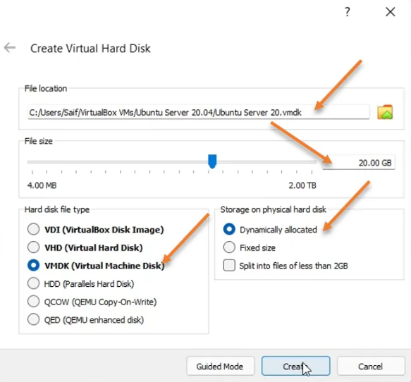

3. Configure the CPU and the Network

   1. In the Virtual Box main menu. The newly created VM is displayed, right click on it and click on settings.

      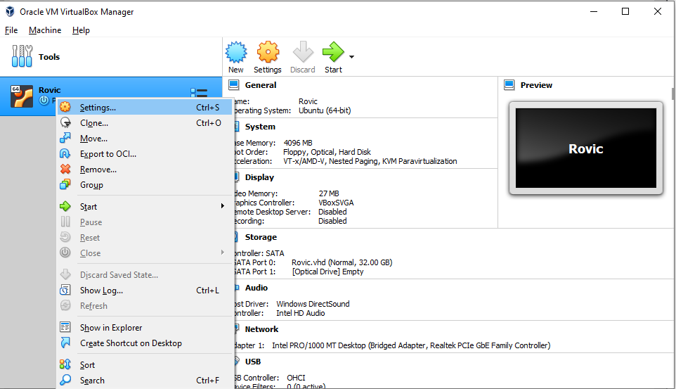

   2. Go to the system tab, click on processor, and increase the CPU count depending on the user’s need.

      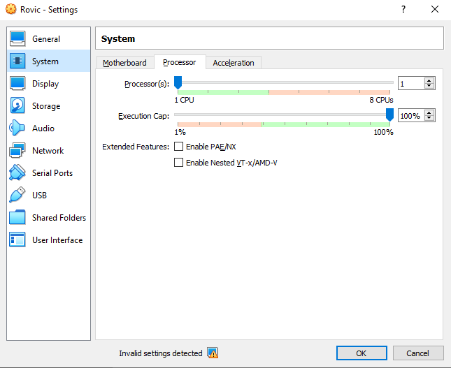

   3. After configuring the CPU, go to the Network tab and change the network into Bridged Adapter. Bridged Network allows the VM to be part of the user’s local area network. Then click OK.

      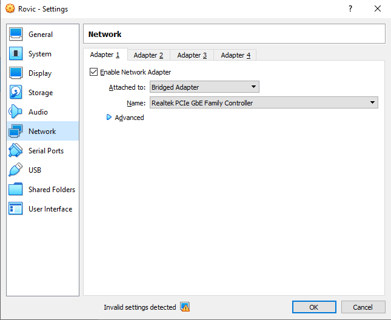

4. In the browser (Edge, Chrome, or any preferred browser), search and install Ubuntu 20.04.4 (live server) LTS ISO file. The file is available here: https://releases.ubuntu.com/20.04/
5. Initiate the Ubuntu server installation

   1. In the Virtual Box, start the VM created.

      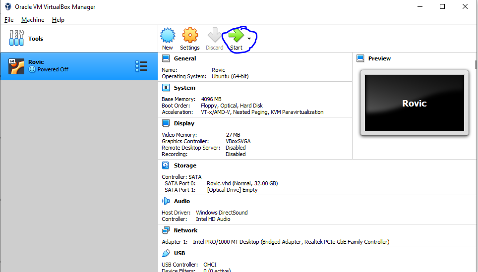

   2. Choose the ISO image downloaded earlier

      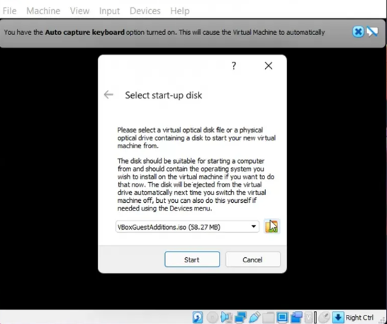

   3. A prompt will appear again. In that, click on Add.

      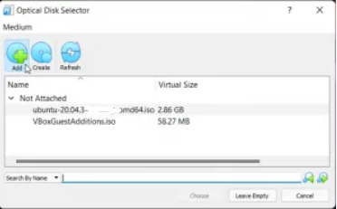

   4. Browse for the file and attach it here, and click on start.

      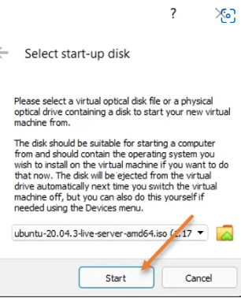

   5. The Ubuntu Server installation will now begin. In the installation wizard, choose the preferred language.

      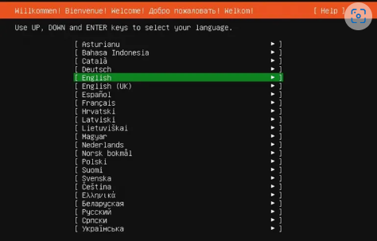

   6. Continue without updating

      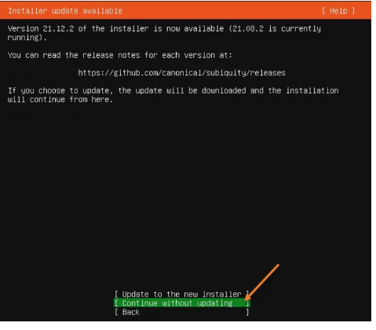

   7. Configure the keyboard layout

      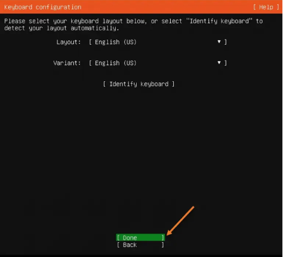

   8. On the bottom right part, right click the Network icon and click Connect Network Adapter.

      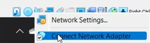

   9. On the next screen, choose to continue without the network.

      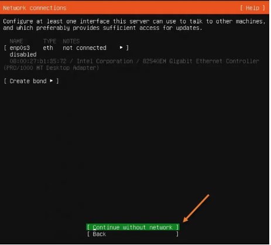

   10. if using a proxy, enter them in the space provided. If not, leave it blank.

       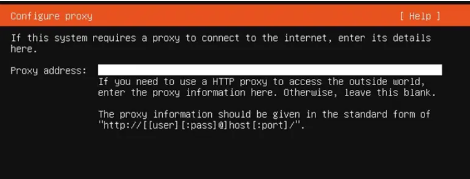

   11. Configure the ubuntu archive mirror. In this case, leave it to default and click Done.

       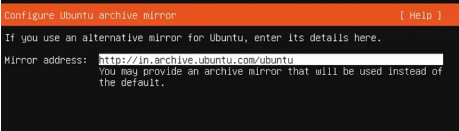

6. Storage selection

   1. Choose to use an entire disk. Then click Done.

      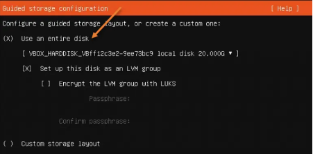

   2. A prompt will appear which warns that the storage will be formatted. Choose Continue.

      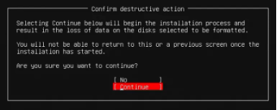

7. Set up a user account by entering the required information: (1) Name; (2) Name of the server; (3) Username; (4) and the password.

   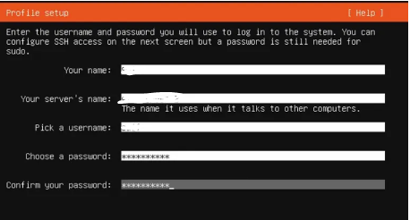

8. Ubuntu server SSH configuration

   1. Click on install OpenSSH server

      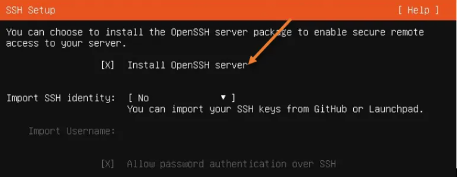

   2. During the reboot, a prompt will appear asking to remove the installation medium, which is already done automatically so press ENTER.

      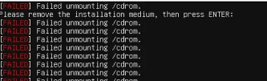

   3. After reboot, a login screen will ask for the username and password provided earlier. The user should be able to log in to the server just fine.

9. Connect the network back. On the bottom right part of the window, right click the network icon and click connect network adapter.

   

10. Virtual box guest addition installation on Ubuntu server 20.04.
    To install, enter the below commands.

    ```
    $ sudo apt-get update
    $ sudo apt-get install virtualbox-guest-dkms -y
    ```

After a few seconds, the VirtualBox additional packages and all dependencies will be installed on the ubuntu server 20.04 and the Ubuntu server will be ready for use.

## Python and Python Environment (Ubuntu)

1. In ubuntu terminal. Check if python is installed, if not, install python by this command
   ```
   $ sudo apt install python3
   ```
2. Then install virtualenv by this command
   ```
   $ sudo pip3 install virtualenv
   ```

## Nginx (Ubuntu)

1. Check for updates
   ```
   $ sudo apt update && sudo apt upgrade -y
   ```
2. Install nginx
   ```
   $ sudo apt install nginx
   ```
3. List the application available to activate
   ```
   $ sudo ufw app list
   ```
4. Allow Nginx HTTP and OpenSSH
   ```
   $ sudo ufw allow 'Nginx HTTP'
   $ sudo ufw allow 'OpenSSH'
   ```
5. Activate firewall
   ```
   $ sudo ufw emable
   ```

## phpMyAdmin (Ubuntu)

1. Install apache2 by this command

   ```
   $ sudo apt-get install apache2
   ```

2. Update ubuntu packages by this command

   ```
   $ sudo apt-get update
   $ sudo apt-get upgrade
   ```

3. Go into the root directory and install lamp server by this command

   ```
   $ sudo su
   $ sudo apt-get install lamp-server
   ```

4. Now install phpMyAdmin by this command

   ```
   $ sudo apt-get install phpmyadmin -y
   ```

5. Configure phpMyAdmin by selecting apache2, then click OK.
   
6. Configure database for phpMyAdmin with dbconfig-common
   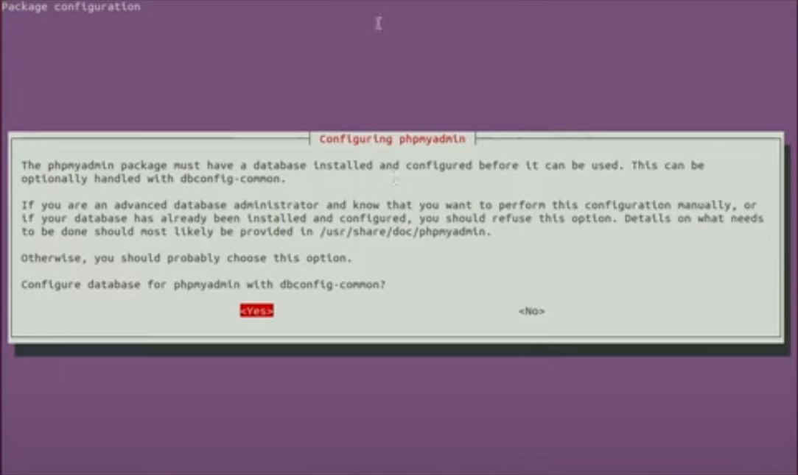
7. Provide a password for phpMyAdmin. A prompt will appear once again after this to confirm the password typed.
   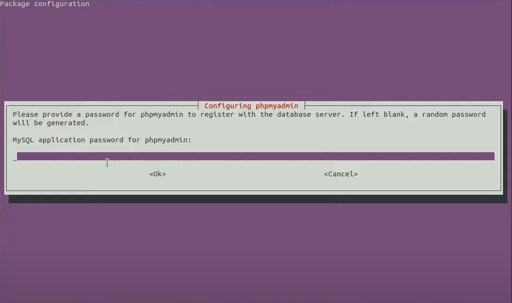
8. Then let Nginx know about phpMyAdmin by symlink

   ```
   $ sudo ln -s /usr/share/phpmyadmin/ /var/www/html
   ```

9. Create an admin that has the highest privileges

   1. Open a mysql command prompt by simply typing ‘mysql’ (minus the quotation marks) in the ubuntu terminal.

      ```
      $ mysql
      ```

   2. Create the admin user and add privileges

      ```
      CREATE USER 'admin'@'localhost' IDENTIFIED BY 'admin';

      GRANT ALL PRIVILEGES ON * . * TO 'admin'@'localhost';

      FLUSH PRIVILEGES;
      ```

# Physical Machine

My project folder was vccne

The frontend can be found in vccne/Front

while the backend can be found in vccne/Back

## Documentation: index.php

The index.php takes 3 inputs: 1 text input, which is the username; and 2 file inputs that takes csv or excel files.

```
<!DOCTYPE html>
<html lang="en">

<head>

    <meta charset="UTF-8">
    <meta http-equiv="X-UA-Compatible" content="IE=edge">
    <meta name="viewport" content="width=device-width, initial-scale=1.0">
    <title>File upload</title>
</head>

<body>
    <div class="container">
        <form action="http://127.0.0.1:5000/Back/upload" method="post" enctype="multipart/form-data">
            Username: <input type='text' name='username' /><BR>
            Individual Master List file: <input type="file" name="file1" accept='.csv, .xls, .xlsx' /><BR>
            Vaccine Master List file: <input type="file" name="file2" accept='.csv, .xls, .xlsx' /><BR>
            <input type="submit" value="Upload" />
        </form>
    </div>

</body>

</html>
```

The next thing I did was to create the backend file which will process the inputs of the user

## Documentation: app.py

### Import needed packages

```
from flask import Flask, jsonify, request
import os
import shutil
```

### Create the Application

```
app = Flask(__name__)
```

### Create a Function that saves a File

```
def saveFile(directory, file, allowed):
    message = None
    if file.filename != '':
        name, fileext = os.path.splitext(file.filename)
        if fileext.lower() in allowed:
            filepath = os.path.join(directory, file.filename)
            if os.path.exists(filepath):
                os.remove(filepath)
            file.save(filepath)
        else:
            str_allowed = ""
            if len(allowed) > 1:
                for i in allowed:
                    str_allowed = str_allowed + i + " or "
                str_allowed = str_allowed[:-4]
            else:
                str_allowed = allowed[0]
            message = name+' extension must be '+str_allowed
    else:
        message = 'Please fill in everything!'

    return message
```

### Create a Function called File Handling

It gets the requested inputs from the front-end. Create a directory named after the username of the user. Calls the saveFile Function to save the files. And lastly, delete the current user directory.

```
@app.route('/Back/upload', methods=['POST'])
def filehandling():
    if request.method == 'POST':
        directory = request.form.get("username")

        message = []
        if directory != "":
            if not os.path.isdir("users"):
                os.mkdir("users")

            directory = os.path.join("users", directory)
            if os.path.isdir(directory):
                shutil.rmtree(directory)
            os.mkdir(directory)

            file = request.files['file1']  # as is

            allowed = ['.csv', '.xls', '.xlsx']
            temp = saveFile(directory, file, allowed)
            if temp is not None:
                if temp not in message:
                    message.append(temp)

            file = request.files['file2']
            allowed = ['.csv', '.xls', '.xlsx']
            temp = saveFile(directory, file, allowed)
            if temp is not None:
                if temp not in message:
                    message.append(temp)
            shutil.rmtree(directory)
        else:
            message.append('Please fill in everything!')
        if not message:
            message.append('file uploaded successfully')
        return jsonify(message)
```

### Code to Run the App

```
if __name__ == "__main__":
    app.run(host='0.0.0.0', debug=True)
```

Check if it runs on xampp

The next thing I did was create a repository on github and push my project there

To push the project on gihub, I use command prompt

First go to the project's folder (which is vccne)

```
D:
cd D:\xampp\htdocs\vccne\
```

initialize local repository

```
git init -b main
```

Add changes

```
git add .
```

Commit changes

```
git commit -m "your message"
```

Add remote

```
git remote add origin <URL of repo created>
```

Push changes

```
git push origin main
```

# Virtual Machine

Log in as root

```
$ sudo su
```

Go to /var/www/

Clone the repository here

```
$ cd /var/www/
$ git clone https://github.com/YOUR-USERNAME/YOUR-REPOSITORY
```

The cloned directory is named as 'vccne'.

Change vccne directory into vxne.com.

```
$ mv /var/www/vccne /var/www/vxne.com
```

Run the flask app as a service

## Documentation: vxne.service

Go to the directory where services are located

```
$ cd /etc/systemd/system
```

Create a new service

```
$ nano vxne.service
```

Then write the configurations of the service

```
[Unit]
Description=Vaccine service
After=network.target

[Service]
User=www-data
Group=www-data
WorkingDirectory=/var/www/vxne.com/Back
ExecStart=python3 app.py
Resetart=always

[Install]
WantedBy=multi-user.target
```

Save the file by Ctrl+x and then type y and hit Enter

Reload the service files to include the new service

```
$ systemctl daemon-reload
```

Start the service

```
$ systemctl start vxne.service
```

Check status of service

```
$ systemctl status vxne.service
```

Enable service on every reboot

```
$ systemctl enable vxne.service
```

Next would be creating and configuring the website on Nginx

## Documentation: vxne.com.conf

Go to /etc/nginx/sites-available
and create a new site

```
$ cd /etc/nginx/sites-available
$ nano vxne.com
```

Configure the site. Do reverse proxy, and all other stuffs.

Make sure to add a code chunk that makes Nginx read PHP file since by default Nginx don't read PHP file.

```
server {
        listen 80;
        listen [::]:80;

        root /var/www;


        server_name vxne.com, www.vxne.com;

        location /Back {
                proxy_set_header Host $http_host;
                proxy_set_header X-Forwarded-For $proxy_add_x_forwarded_for;
                proxy_set_header X-Forwarded-Proto $scheme;
                proxy_set_header Upgrade $http_upgrade;
                #proxy_set_header Connection $connection_upgrade;
                proxy_redirect off;
                proxy_buffering off;
                proxy_pass http://localhost:5000;
        }

        location /vxne.com/Front/ {
                alias /var/www/vxne.com/Front/;
                index index.php;
                try_files $uri $uri/ =404;
        }


        location ~ \.php$ {
        #try_files $uri;
        include fastcgi_params;
        fastcgi_split_path_info ^(.+\.php)(/.+)$;
        fastcgi_pass unix:/run/php/php7.4-fpm.sock;
        fastcgi_index index.php;
        fastcgi_param SCRIPT_FILENAME $document_root$fastcgi_script_name;
        }

}
```

Save the file by Ctrl+x and then y. Lastly, hit Enter

Enable the site by creating a symlink to sites-enabled

```
$ ln -s /etc/nginx/sites-available/vxne.com /etc/nginx/sites-enabled/vxne.com
```

Remove the default.conf in sites-enabled since it will conflict

```
$ rm /etc/nginx/sites-enabled/default
```

Then restart Nginx for changes to take effect

```
$ systemctl restart nginx
```

Edit the frontend file: index.php

First check the current ip address

```
$ ip a
```

go to the frontend directory and edit index.php using nano

```
$ cd /var/www/vxne.com/Front
$ nano index.php
```

Change the ip since it is still 127.0.0.1:5000 to the current ip without 5000. When done, Ctrl+x then hit y. And lastly, hit Enter to save changes.

Now you may access the website with no issue

## Documentation: scheduled task

The purpose of the scheduled task is to empty the user directory every 12 AM, this allows the removal of stagnant files due to interrupted transactions

A cronjob can be used to answer this problem

Create a cronjob

```
$ crontab -e
```

Create a job that empty a directory every 12 AM

```
0 16 * * * rm -rf /var/www/vxne.com/Back/users/*
```
