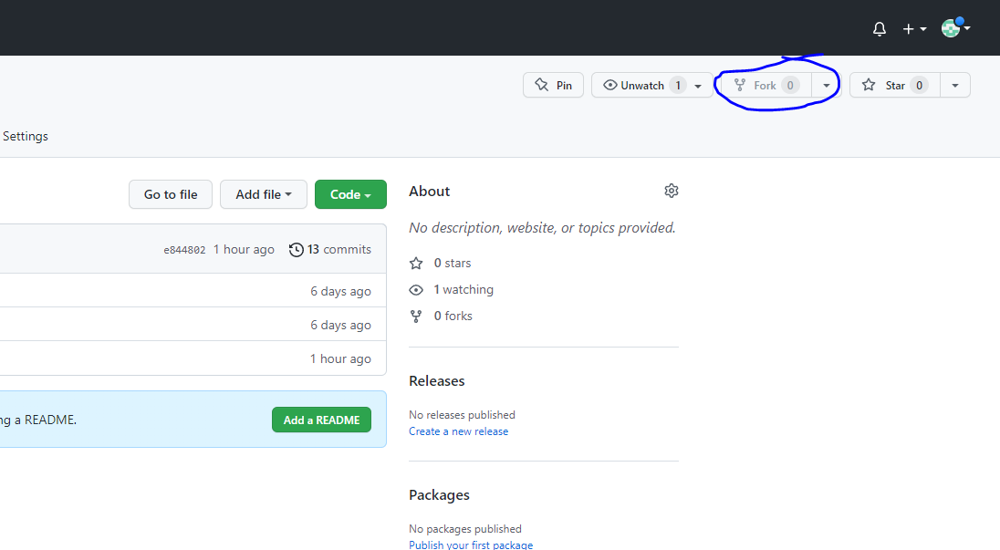
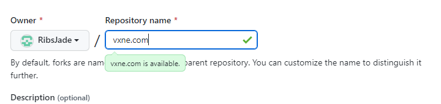

Since the solution created in this repository will still be integrated by the supervisor, this file will include instructions on how to use the Github repository containing the project. Doing this helps easy integration and configuration of the functionality to the existing system.

# Github

## Fork the repository

1. Fork the repository
   
2. Name the repository as 'vxne.com'
   

# Virtual Machine (Ubuntu 40.02 LTS)

## Log in as root

1. To log in as root in Ubuntu, type the command below

   ```
   $ sudo su
   ```

## Clone your repository

1. Clone your repository on /var/www/

   ```
   $ git clone <your repository url>
   ```

## Copy the service and site configuration files to the right destination

1. Copy the service file to its proper location

   ```
   $ cp /var/www/vxne.com/Include/vxne.service /etc/systemd/system/vxne.service
   ```

2. Copy the site configuration file to its proper destination

   ```
   $ cp /var/www/vxne.com/Include/vxne.com /etc/nginx/sites-available/vxne.com
   ```

3. Symlink the newly pasted site configuration file to the sites-enabled

   ```
   $ cp /etc/nginx/sites-available/vxne.com /etc/nginx/sites-available/vxne.com
   ```

4. Make sure that the default configuration is already deleted

   ```
   $ rm /etc/nginx/sites-enabled/default
   ```

## Run the service and restart Nginx

1. Reload the service files to include the new service

   ```
   $ systemctl daemon-reload
   ```

2. Start the service

   ```
   $ systemctl start vxne.service
   ```

3. Check status of service

   ```
   $ systemctl status vxne.service
   ```

4. Enable service on every reboot

   ```
   $ systemctl enable vxne.service
   ```

5. Restart Nginx

   ```
   $ systemctl restart nginx
   ```

## Create Cronjob

1. Edit crontab

   ```
   $ crontab -e
   ```

2. Create a scheduled task that deletes the files in the user directory every 12 AM

   ```
   $ 0 16 * * * rm -rf /var/www/vxne.com/Back/users/*
   ```

## Configure IP address

1. Check the IP address of the virtual machine by typing

   ```
   $ ip address
   ```

2. Go to /var/www/vxne.com/Front and open index.php

   ```
   $ cd /var/www/vxne.com/Front
   $ nano index.php
   ```

3. Change the ip address into the Ip address of the virtual machine, remove :5000. Then save using Ctrl+x, type y, and hit Enter.

## Test if services are running

1. To make sure that all services are running on the background
   ```
   $ systemctl status nginx.service
   $ systemctl status vxne.service
   $ systemctl status cron
   ```

# Browser

## Enter the website

1. Enter the IP address alongside the location of the index.php in the web browser. An example is shown below

   http://Your.IP.Address/Location-of-index.php

   http://192.168.1.8/vxne.com/Front/

2. After typing the URL, the user will be redirected to the website
3. Enter the required information, then click upload
4. If required informations are all met then a message is shown in the screen that tells that the file is uploaded successfully else it would return an error. However the files will not be found in the directory since it will be deleted after transaction. To test this one, disable first the delete function in the app.py by commenting out the shutil.rmtree(directory) on line 64. When done, you will notice that the users directory would not be empty after a transaction
